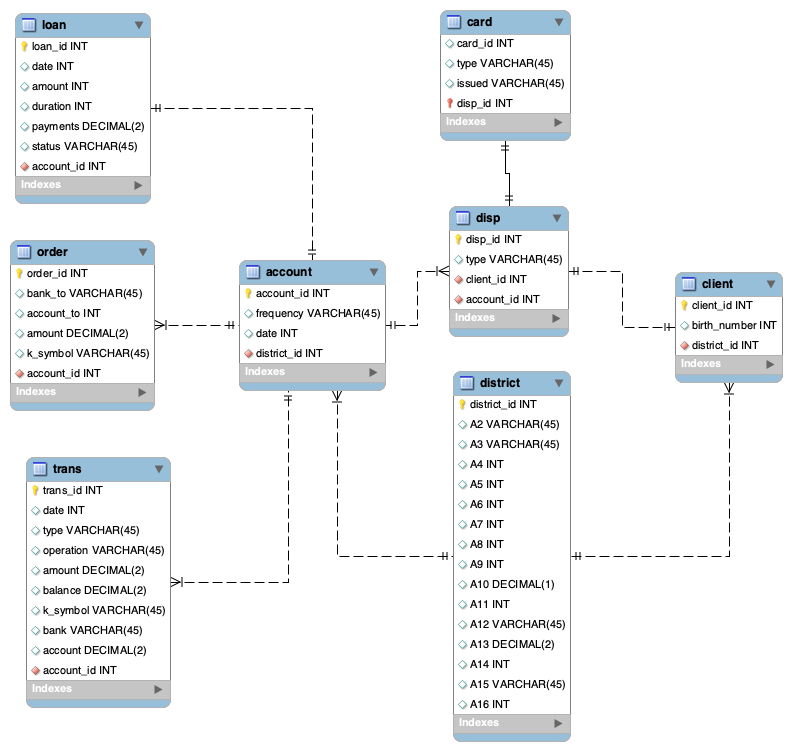

# Improvements:

Folgende Punkte können in dem Notebook angepasst werden:
- Anstatt 60/20/20 train/val/test solit kann ich auch 80/20 train/test split machen mit einen k-fold-crossvalidation -> Dies ersetzt dann sozusagen den val split da auf dem fold die parameter trainiert werden.
  - Würde besonders sinn machen, da wir wenige daten haben. 
- **Info:** Aktuell fehlen noch die Informationen ob ein Attribut unique ist und ob es optional ist oder nicht. 
- 

# Importe

```{python}
import matplotlib.pyplot as plt
import numpy as np
import pandas as pd
import seaborn as sns
from matplotlib.patches import Patch
from sklearn.model_selection import train_test_split
```

```{python}
# === GLOBAL CONSTANTS ===
RANDOM_STATE = 42
FIG_SIZE_DEFAULT = (14, 6)
FIG_SIZE_LARGE = (16, 12)

# Raw Data Path
PATH_RAW = "../data/raw/"

# File Paths
PATH_RAW_ACCOUNT = PATH_RAW + "account.csv"
PATH_RAW_CARD = PATH_RAW + "card.csv"
PATH_RAW_CLIENT = PATH_RAW + "client.csv"
PATH_RAW_DISP = PATH_RAW + "disp.csv"
PATH_RAW_DISTRICT = PATH_RAW + "district.csv"
PATH_RAW_LOAN = PATH_RAW + "loan.csv"
PATH_RAW_ORDER = PATH_RAW + "order.csv"
PATH_RAW_TRANS = PATH_RAW + "trans.csv"

# Study Design Constants
ROLLUP_MONTHS = 12
LAG_MONTHS = 1
TOTAL_HISTORY_MONTHS = ROLLUP_MONTHS + LAG_MONTHS  # 13
JUNIOR_AGE_CUTOFF = 21  # max junior card holder age ≈ 20.89

# Data Splits
TRAIN_RATIO = 0.6
VAL_RATIO = 0.2
TEST_RATIO = 0.2


# Apply Plotting Theme
def set_plot_style():
    """Applies the project's standard plotting style."""
    sns.set_theme(style="whitegrid", context="paper", palette="viridis")
    plt.rcParams["figure.figsize"] = FIG_SIZE_DEFAULT
    plt.rcParams["axes.titlesize"] = 14
    plt.rcParams["axes.titleweight"] = "bold"
    plt.rcParams["axes.labelsize"] = 12
    plt.rcParams["xtick.labelsize"] = 10
    plt.rcParams["ytick.labelsize"] = 10


# Initialize style on startup
set_plot_style()
```

# Load Data

```{python}
account = pd.read_csv(PATH_RAW_ACCOUNT, sep=";")
card = pd.read_csv(PATH_RAW_CARD, sep=";")
client = pd.read_csv(PATH_RAW_CLIENT, sep=";")
disp = pd.read_csv(PATH_RAW_DISP, sep=";")
district = pd.read_csv(PATH_RAW_DISTRICT, sep=";")
loan = pd.read_csv(PATH_RAW_LOAN, sep=";")
order = pd.read_csv(PATH_RAW_ORDER, sep=";")
trans = pd.read_csv(PATH_RAW_TRANS, sep=";", low_memory=False)

print("Data loaded.")
```

# Datenstruktur verstehen

## PK Check

Ausgabe von:

- Uniqueness
- Count
- Duplicates
- Missing
- Data Tyoe
für alle Tabellen

```{python}
def check_pk(df, pk_col, table_name):
    """Prüft ob eine Spalte als Primary Key geeignet ist (Uniqueness, Vollständigkeit, Datentyp)."""
    print(f"--- {table_name} (PK: {pk_col}) ---")
    print(f"  Unique:     {df[pk_col].is_unique}")
    print(f"  Count:      {df.shape[0]}")
    print(f"  Duplicates: {df[pk_col].duplicated().sum()}")
    print(f"  Missing:    {df[pk_col].isna().sum()}")
    print(f"  Dtype:      {df[pk_col].dtype}")
    print()


check_pk(account, "account_id", "Account")
check_pk(card, "card_id", "Card / Credit Card")
check_pk(client, "client_id", "Client")
check_pk(disp, "disp_id", "Disp / Disposition")
check_pk(district, "A1", "District / Demograph")
check_pk(loan, "loan_id", "Loan")
check_pk(order, "order_id", "Order / Permanent Order")
check_pk(trans, "trans_id", "Trans / Transactions")
```

### Entschlüsse
- Alle Counts stimmen mit dem pdf überein
- Alle PK sind Unique
- Alle PK sind vorhanden
- Alle PK haben denselben Typ

> Bei district / Demographic ist die PK Spalte nicht ```district_id``` sonder ```A1```. Diese Spalte wird von ```A1``` nach ```district_id``` umbenannt. 

```{python}
district.rename(columns={"A1": "district_id"}, inplace=True)
district.head()
```

## Kardinalitäten Check

Analyse wie die Tabellen zusammenhängen

```{python}
# Define all FK relationships: (fk_table, fk_col, pk_table, pk_col)
relations = [
    (
        account,
        "district_id",
        district,
        "district_id",
        "account.district_id -> district.district_id",
    ),
    (
        client,
        "district_id",
        district,
        "district_id",
        "client.district_id -> district.district_id",
    ),
    (disp, "client_id", client, "client_id", "disp.client_id -> client.client_id"),
    (
        disp,
        "account_id",
        account,
        "account_id",
        "disp.account_id -> account.account_id",
    ),
    (card, "disp_id", disp, "disp_id", "card.disp_id -> disp.disp_id"),
    (
        loan,
        "account_id",
        account,
        "account_id",
        "loan.account_id -> account.account_id",
    ),
    (
        order,
        "account_id",
        account,
        "account_id",
        "order.account_id -> account.account_id",
    ),
    (
        trans,
        "account_id",
        account,
        "account_id",
        "trans.account_id -> account.account_id",
    ),
]

rows = []
for fk_df, fk_col, pk_df, pk_col, label in relations:
    fk_values = fk_df[fk_col].dropna()
    pk_values = pk_df[pk_col]

    # Referential integrity: all FK values exist in PK?
    orphans = ~fk_values.isin(pk_values)

    # Cardinality: how many FK rows per PK value?
    counts = fk_values.value_counts()

    rows.append(
        {
            "Relation": label,
            "FK rows": len(fk_values),
            "FK nulls": fk_df[fk_col].isna().sum(),
            "Orphans": orphans.sum(),
            "PK used": fk_values.nunique(),
            "PK total": len(pk_values),
            "Min": counts.min(),
            "Max": counts.max(),
            "Median": counts.median(),
            "Cardinality": "1:1" if counts.max() == 1 else f"1:N (max {counts.max()})",
        }
    )

cardinality_df = pd.DataFrame(rows)
cardinality_df.style.set_properties(**{"text-align": "left"})
```

### Erkenntnisse

- Keine Orphans und keine FK-Nulls -> referentielle Integrität ist vollständig gegeben
- **disp** ist die zentrale Brücken-Tabelle zwischen Client und Account

| Relation | Kardinalität |
|---|---|
| district -> account | 1:N (32–554) |
| district -> client | 1:N (43–663) |
| client -> disp | 1:1 |
| account -> disp | 1:N (max 2) |
| disp -> card | 1:1 (optional, 892/5369) |
| account -> loan | 1:1 (optional, 682/4500) |
| account -> order | 1:N (max 5) |
| account -> trans | 1:N (max 675) |


> Da `card.disp_id` als PK der Card-Tabelle verwendet wird und gleichzeitig FK auf disp ist, ist die Beziehung disp -> card tatsächlich **1:0..1** (optional 1:1).

## ERD

Das ERD wurde basierend auf den vorherigen Analysen erstellt. 



## Tabellenübersicht: Datentypen, Speicher & deskriptive Statistiken
Bevor wir in die Datenqualität einsteigen, verschaffen wir uns einen kompakten Überblick über alle Tabellen: Datentypen, Speicherverbrauch und die wichtigsten deskriptiven Kennzahlen der numerischen Spalten.

```{python}
# Dictionary aller DataFrames für einfachere Iteration (wird auch in späteren Zellen wiederverwendet)
dataframes = {
    "account": account,
    "client": client,
    "disp": disp,
    "district": district,
    "loan": loan,
    "order": order,
    "trans": trans,
    "card": card,
}

# Kompakte Übersicht aller Tabellen: Zeilen, Spalten, Datentypen und Speicherverbrauch
for name, df in dataframes.items():
    print(f"{'=' * 50}")
    print(f"Tabelle: {name.upper()} ({df.shape[0]} Zeilen, {df.shape[1]} Spalten)")
    print(f"{'=' * 50}")
    print(df.dtypes.to_string())
    print(f"\nSpeicher: {df.memory_usage(deep=True).sum() / 1e6:.1f} MB")
    print()

# Numerische Zusammenfassung der wichtigsten Tabellen
print("=== DESCRIBE: trans (numerische Spalten) ===")
print(trans.describe().round(1).to_string())
print()
print("=== DESCRIBE: loan ===")
print(loan.describe().round(1).to_string())
print()
print("=== DESCRIBE: district (demografische Kennzahlen) ===")
print(district.describe().round(1).to_string())
```

# Datenqualität und vorbereitende Exploration

## Datenqualität pro Tabelle

```{python}
print("=== CHECK AUF DUPLIKATE & FEHLENDE WERTE ===")
for name, df in dataframes.items():
    duplicates = df.duplicated().sum()
    missing_cols = df.isnull().sum()
    missing_cols = missing_cols[missing_cols > 0]

    print(f"Tabelle: {name.upper()}")
    print(f"  Duplikate gefunden: {duplicates}")
    if len(missing_cols) > 0:
        print(f"  Fehlende Werte (Achtung!):\n{missing_cols.to_string()}")
    else:
        print("  Keine fehlenden Werte.")
    print("-" * 40)
```

### Analyse fehlender Werte in `trans`
Die Tabelle `trans` ist die einzige mit fehlenden Werten. Vier Spalten sind betroffen: `operation` (17%), `k_symbol` (46%), `bank` (74%) und `account` (72%). Bevor wir diese Werte im Feature Engineering behandeln, müssen wir verstehen, ob es sich um **strukturelle** (systembedingte) oder **zufällige** Lücken handelt. Dazu analysieren wir die Verteilung der NaNs in Abhängigkeit vom Transaktionstyp (`type`) und der Transaktionsart (`operation`).

```{python}
missing_cols = ["operation", "k_symbol", "bank", "account"]

# 1. NaN-Anteil pro Spalte nach Transaktionstyp (type: credit / withdrawal)
print("=== NaN-Anteil (%) nach Transaktionstyp ===")
for col in missing_cols:
    nan_by_type = (
        trans.groupby("type")[col].apply(lambda x: x.isna().mean() * 100).round(1)
    )
    print(f"\n{col}:")
    print(nan_by_type.to_string())

# 2. NaN-Anteil pro Spalte nach Operation
print("\n\n=== NaN-Anteil (%) nach Operation ===")
for col in missing_cols:
    # operation selbst hat NaNs, daher fillna für die Gruppierung
    nan_by_op = (
        trans.assign(operation_group=trans["operation"].fillna("(NaN)"))
        .groupby("operation_group")[col]
        .apply(lambda x: x.isna().mean() * 100)
        .round(1)
        .sort_values(ascending=False)
    )
    print(f"\n{col}:")
    print(nan_by_op.to_string())

# 3. Kompakte Kreuztabelle: Wie viele Transaktionen pro operation haben bank/account?
print(
    "\n\n=== Transaktionen pro Operation: Anzahl und NaN-Anteil für bank & account ==="
)
op_summary = (
    trans.assign(operation_group=trans["operation"].fillna("(NaN)"))
    .groupby("operation_group")
    .agg(
        n=("trans_id", "count"),
        bank_nan_pct=("bank", lambda x: round(x.isna().mean() * 100, 1)),
        account_nan_pct=("account", lambda x: round(x.isna().mean() * 100, 1)),
        k_symbol_nan_pct=("k_symbol", lambda x: round(x.isna().mean() * 100, 1)),
    )
    .sort_values("n", ascending=False)
)
print(op_summary.to_string())
```

### Erkenntnisse zu fehlenden Werten in `trans`

Die fehlenden Werte sind **strukturell bedingt** und nicht zufällig:

- **`operation`** (17% NaN): Fehlt bei Zinsgutschriften und ähnlichen System-Buchungen, die keine explizite Kundenoperation darstellen.
- **`k_symbol`** (46% NaN): Viele Transaktionen (z.B. Barein-/auszahlungen) haben keinen standardisierten Verwendungszweck - das Feld ist lediglich optional.
- **`bank` und `account`** (74% bzw. 72% NaN): Fehlen bei allen internen Operationen (Bareinzahlung, Barauszahlung, Kreditkartenabhebung). Nur bei Überweisungen zwischen Banken (`collection_from_another_bank`, `remittance_to_another_bank`) ist eine Partnerbank/-konto vorhanden.

**Konsequenz für das Feature Engineering:** Die NaNs können nicht sinnvoll imputiert werden, da sie "kein Wert vorhanden" bedeuten (z.B. eine Bareinzahlung hat schlicht keine Partnerbank). Stattdessen sollten sie als eigene Kategorie behandelt oder bei der Aggregation ignoriert werden. Die Anzahl der Transaktionen *mit* vs. *ohne* Partnerbank könnte selbst ein nützliches Feature sein.

### Kategorien decodieren
Viele Datenpunkte in den Tabellen `account`, `trans` und `order` enthalten tschechische Strings. Um die Übersichtlichkeit und das Feature Engineering später zu vereinfachen, werden diese Begriffe entsprechend der Dokumentation (`00_data_desc.md`) ins Englische übersetzt.

```{python}
# Mappings basierend auf 00_data_desc.md

freq_mapping = {
    "POPLATEK MESICNE": "monthly",
    "POPLATEK TYDNE": "weekly",
    "POPLATEK PO OBRATU": "after transaction",
}
account["frequency"] = account["frequency"].map(freq_mapping)

trans_type_mapping = {"PRIJEM": "credit", "VYDAJ": "withdrawal"}
trans["type"] = trans["type"].map(trans_type_mapping)

trans_op_mapping = {
    "VYBER KARTOU": "credit_card_withdrawal",
    "VKLAD": "credit_in_cash",
    "PREVOD Z UCTU": "collection_from_another_bank",
    "VYBER": "withdrawal_in_cash",
    "PREVOD NA UCET": "remittance_to_another_bank",
}
trans["operation"] = (
    trans["operation"].map(trans_op_mapping).fillna(trans["operation"])
)  # NaN bei Zinsgutschriften belassen oder String ändern

k_symbol_mapping = {
    "POJISTNE": "insurance_payment",
    "SIPO": "household_payment",
    "LEASING": "leasing",
    "UVER": "loan_payment",
    "SLUZBY": "payment_for_statement",
    "UROK": "interest_credited",
    "SANKC. UROK": "sanction_interest",
    "DUCHOD": "old_age_pension",
}
trans["k_symbol"] = trans["k_symbol"].map(k_symbol_mapping).fillna(trans["k_symbol"])
order["k_symbol"] = order["k_symbol"].map(k_symbol_mapping).fillna(order["k_symbol"])

print("Tschechische Begriffe in `account`, `trans` und `order` erfolgreich decodiert!")
```

### Geburtsdatum und Geschlecht extrahieren
In der `client` Tabelle ist das Geschlecht im Geburtsdatum (`birth_number`) einkodiert. Bei Frauen wird der Zahl für den Monat der Wert 50 hinzugefügt. Wir splitten dies in zwei separate Spalten `gender` (M/F) und `birth_date` auf und entfernen die alte kryptische Spalte.

```{python}
# 'birth_number' format ist YYMMDD für Männer, YY(MM+50)DD für Frauen


def extract_gender_and_birth(birth_number):
    birth_str = str(birth_number).zfill(
        6
    )  # Sicherstellen dass es 6 Stellen sind (z.B. für Jg. 1900+)
    year = int(birth_str[:2])
    month = int(birth_str[2:4])
    day = int(birth_str[4:])

    # Prefix "19" setzen (da Daten aus den späten 90ern sind, sind die Kunden aus den 1900ern)
    year += 1900

    if month > 50:
        gender = "F"
        month -= 50
    else:
        gender = "M"

    # Zusammenbauen als echten Datetime String
    return pd.Series(
        [gender, pd.to_datetime(f"{year}-{month:02d}-{day:02d}", errors="coerce")]
    )


client[["gender", "birth_date"]] = client["birth_number"].apply(
    extract_gender_and_birth
)

# Vorherige Spalte droppen
client = client.drop(columns=["birth_number"])

client.head(3)
```

### Datentypen korrigieren & Zeitliche Abdeckung überprüfen
Aktuell liegen in mehreren Tabellen Datumsangaben im Format `YYMMDD` als Integer oder String vor. Wir konvertieren diese in aussagekräftige `datetime` Objekte. Bei der Tabelle `card` sind teils noch Stunden an das Datum gehängt, weshalb wir explizit nur die ersten 6 Zeichen (`str[:6]`) für die Datumsextraktion nutzen.
Gleichzeitig prüfen wir den minimalen und maximalen Zeitraum, um eine Vorstellung über das Gesamthistorien-Fenster zu erhalten.

```{python}
# Format YYMMDD (int/str) nach datetime konvertieren für account, card, loan und trans
def parse_date(col):
    # Idempotenz-Check: Falls bereits datetime, nichts tun
    if pd.api.types.is_datetime64_any_dtype(col):
        return col

    # Zu String machen, nur die ersten 6 Zeichen nehmen (wegen Zeitzusätzen in `card`)
    # Annahme: Alle Jahreszahlen liegen im 20. Jahrhundert (19xx), da die Daten aus den 1990ern stammen.
    col_str = col.astype(str).str[:6].str.zfill(6)
    return pd.to_datetime("19" + col_str, format="%Y%m%d", errors="coerce")


account["date"] = parse_date(account["date"])
card["issued"] = parse_date(card["issued"])
loan["date"] = parse_date(loan["date"])
trans["date"] = parse_date(trans["date"])

print("\n=== ZEITLICHE ABDECKUNG (MIN - MAX) ===")
print(
    f"Account Eröffnungen:  {account['date'].dt.date.min()}  bis  {account['date'].dt.date.max()}"
)
print(
    f"Transaktionen:        {trans['date'].dt.date.min()}  bis  {trans['date'].dt.date.max()}"
)
print(
    f"Kreditvergabe:        {loan['date'].dt.date.min()}  bis  {loan['date'].dt.date.max()}"
)
print(
    f"Karten Ausstellungen: {card['issued'].dt.date.min()}  bis  {card['issued'].dt.date.max()}"
)

# Variablen für die zukünftige Berechnung des Baseline rollups
min_global_date = trans["date"].min()
max_global_date = trans["date"].max()
total_months_available = (
    (max_global_date.year - min_global_date.year) * 12
    + max_global_date.month
    - min_global_date.month
)
print(f"\n=> Gesamte Transaktionshistorie umfasst ca. {total_months_available} Monate.")
```

# Exploration der Basisdaten

In diesem Kapitel untersuchen wir systematisch jede Tabelle des Datensatzes, bevor wir zum Feature Engineering übergehen. Ziel ist ein fundiertes Verständnis der Verteilungen, Muster und potenziellen Prädiktoren für das Kreditkarten-Affinitätsmodell.

## Exploration der Kontodaten (account)

Wir beginnen mit der `account` Tabelle, da Konten die zentrale Einheit für unsere Analyse darstellen. Jede Kreditkarte wird über eine Disposition einem Konto zugeordnet. Wir untersuchen die Verteilung der Kontoauszugs-Frequenzen und die zeitliche Verteilung der Kontoeröffnungen.

```{python}
fig, axes = plt.subplots(1, 2, figsize=FIG_SIZE_DEFAULT)

# 1. Kontoauszugs-Frequenz
freq_counts = account["frequency"].value_counts()
sns.barplot(
    x=freq_counts.values,
    y=freq_counts.index,
    hue=freq_counts.index,
    ax=axes[0],
)
axes[0].set_title("Kontoauszugs-Frequenz")
axes[0].set_xlabel("Anzahl Konten")
axes[0].set_ylabel("Frequenz")
for i, v in enumerate(freq_counts.values):
    axes[0].text(v + 20, i, str(v), va="center")

# 2. Kontoeröffnungen über die Zeit (monatlich)
# Ensure account["date"] is datetime (handled in load cell now)
account["open_month"] = account["date"].dt.to_period("M").dt.to_timestamp()
monthly_openings = account.groupby("open_month").size()
axes[1].bar(
    monthly_openings.index,
    monthly_openings.values,
    width=25,
    alpha=0.8,
)
axes[1].set_title("Monatliche Kontoeröffnungen")
axes[1].set_xlabel("Zeit")
axes[1].set_ylabel("Anzahl neue Konten")
axes[1].tick_params(axis="x", rotation=45)

plt.tight_layout()
plt.show()

print("Account Stichprobe:")
print(
    account[["account_id", "district_id", "frequency", "date"]]
    .sample(3, random_state=RANDOM_STATE)
    .to_string(index=False)
)
```

## Exploration der Kundendaten (client)

Die `client` Tabelle enthält Alter und Geschlecht (bereits aus `birth_number` extrahiert). Für das Baseline-Modell sind "Alter" und "Geschlecht" explizit geforderte Features. Wir untersuchen deren Verteilungen.

```{python}
# Alter berechnen (Ende 1998 als Analyse-Zeitpunkt der gesamten Historie)
max_date = trans["date"].max()
client["age"] = (max_date - client["birth_date"]).dt.days // 365

fig, axes = plt.subplots(1, 2, figsize=FIG_SIZE_DEFAULT)

# 1. Alters- und Geschlechterverteilung (überlappend, transparent)
sns.histplot(
    data=client,
    x="age",
    hue="gender",
    multiple="layer",  # statt "stack"
    bins=30,
    alpha=0.45,  # Transparenz für Überlappung
    ax=axes[0],
)
axes[0].set_title("Alters- und Geschlechterverteilung der Kunden")
axes[0].set_xlabel("Alter (relativ zu Ende 1998)")
axes[0].set_ylabel("Anzahl Kunden")

# 2. Geschlechterverteilung
gender_counts = client["gender"].value_counts()
axes[1].bar(gender_counts.index, gender_counts.values, color=["C0", "C1"], width=0.5)
axes[1].set_title("Geschlechterverteilung")
axes[1].set_xlabel("Geschlecht")
axes[1].set_ylabel("Anzahl Kunden")
for i, v in enumerate(gender_counts.values):
    axes[1].text(i, v + 20, str(v), ha="center")

plt.tight_layout()
plt.show()

print("Altersstatistik:")
print(client["age"].describe().round(1))
print(f"\nGeschlechterverteilung:\n{gender_counts}")
```

## Exploration der Dispositionsdaten (disp)

Die `disp` Tabelle verbindet Kunden mit Konten und definiert deren Berechtigungsstufe (Owner vs. User). Nur Owner dürfen Daueraufträge erteilen und Kredite beantragen. Für die Kreditkarten-Analyse ist relevant, wie viele Konten Owner vs. User haben und wie viele Konten von mehreren Personen geteilt werden.

```{python}
fig, axes = plt.subplots(1, 2, figsize=FIG_SIZE_DEFAULT)

# 1. Owner vs. User Verteilung
disp_type_counts = disp["type"].value_counts()
axes[0].bar(
    disp_type_counts.index,
    disp_type_counts.values,
    color=["C0", "C1"],
    width=0.5,
)
axes[0].set_title("Dispositionstyp: Owner vs. User")
axes[0].set_xlabel("Typ")
axes[0].set_ylabel("Anzahl Dispositionen")
for i, v in enumerate(disp_type_counts.values):
    axes[0].text(i, v + 20, str(v), ha="center")

# 2. Anzahl Dispositionen pro Konto (wie viele Konten werden geteilt?)
disps_per_account = disp.groupby("account_id").size().value_counts().sort_index()
labels = {1: "Einzelkonto\n(1 Person)", 2: "Geteiltes Konto\n(2 Personen)"}
x_labels = [labels.get(k, str(k)) for k in disps_per_account.index]
axes[1].bar(x_labels, disps_per_account.values, color=["C0", "C1"], width=0.5)
axes[1].set_title("Einzel- vs. geteilte Konten")
axes[1].set_xlabel("Kontotyp")
axes[1].set_ylabel("Anzahl Konten")
for i, v in enumerate(disps_per_account.values):
    axes[1].text(i, v + 20, str(v), ha="center")

plt.tight_layout()
plt.show()

shared_accounts = (disp.groupby("account_id").size() > 1).sum()
print(
    f"Konten mit genau 1 Disposition (Einzelkonto): {(disp.groupby('account_id').size() == 1).sum()}"
)
print(f"Konten mit 2 Dispositionen (geteiltes Konto): {shared_accounts}")
```

Die disp Tabelle hat 5369 Einträge - einen pro Kunde. Jeder Eintrag verknüpft einen Kunden mit einem Konto und gibt ihm eine Rolle:

- OWNER = Kontoinhaber (darf alles: Daueraufträge, Kredite etc.)                                         
- DISPONENT = Mitbenutzer (eingeschränkte Rechte, z.B. Partner)                                               
                                                       
Die 4500 Konten verteilen sich so:                     
                                                       
- Einzelkonto: 1 Disposition = nur 1 Owner, keine zweite Person                                          
- Geteiltes Konto: 2 Dispositionen = 1 Owner + 1 Disponent auf demselben Konto                          

## Exploration der Regionaldaten (district)

Die `district` Tabelle liefert demografische Kennzahlen der 77 Bezirke. "Domizilregion" ist ein gefordertes Baseline-Feature. Wir untersuchen die Verteilungen der wichtigsten Variablen: Durchschnittsgehalt (`A11`), Arbeitslosenquote (`A13`), Urbanisierungsgrad (`A10`) und die Anzahl Kunden pro Bezirk.

```{python}
fig, axes = plt.subplots(2, 2, figsize=(14, 10))

# 1. Durchschnittsgehälter
sns.histplot(district["A11"], kde=True, ax=axes[0, 0])
axes[0, 0].set_title("Durchschnittsgehalt pro Bezirk (A11)")
axes[0, 0].set_xlabel("Durchschnittsgehalt (CZK)")
axes[0, 0].set_ylabel("Anzahl Bezirke")

# 2. Arbeitslosenquote
sns.histplot(district["A13"], kde=True, ax=axes[0, 1])
axes[0, 1].set_title("Arbeitslosenquote 1996 pro Bezirk (A13)")
axes[0, 1].set_xlabel("Arbeitslosenquote (%)")
axes[0, 1].set_ylabel("Anzahl Bezirke")

# 3. Urbanisierungsgrad
sns.histplot(district["A10"], kde=True, ax=axes[1, 0])
axes[1, 0].set_title("Urbanisierungsgrad pro Bezirk (A10)")
axes[1, 0].set_xlabel("Anteil Stadtbevölkerung (%)")
axes[1, 0].set_ylabel("Anzahl Bezirke")

# 4. Korrelation der wichtigsten Bezirksvariablen
district_features = district[["A10", "A11", "A13", "A14"]].rename(
    columns={
        "A10": "Urban %",
        "A11": "Gehalt",
        "A13": "Arbeitslos %",
        "A14": "Unternehmer",
    }
)
sns.heatmap(
    district_features.corr(),
    annot=True,
    fmt=".2f",
    ax=axes[1, 1],
    vmin=-1,
    vmax=1,
    cmap="viridis",  # Explizit das Theme 'viridis' setzen
)
axes[1, 1].set_title("Korrelation der Bezirks-Kennzahlen")

plt.tight_layout()
plt.show()

# Anzahl Konten pro Bezirk (Top 10)
accounts_per_district = (
    account.groupby("district_id").size().sort_values(ascending=False)
)
print("Top-10 Bezirke nach Anzahl Konten:")
print(accounts_per_district.head(10).to_string())
```

## Exploration der Transaktionsdaten (trans)

Die `trans` Tabelle ist mit über 1 Mio. Einträgen die grösste und wichtigste Datenquelle für das Feature Engineering. Transaktionsmuster vor dem Kreditkartenkauf bilden die Grundlage des Rollup-Zeitfensters. Wir analysieren die zeitliche Verteilung, Transaktionstypen und -volumina, Verwendungszwecke sowie die Saldenentwicklung.

```{python}
fig, axes = plt.subplots(2, 2, figsize=(16, 10))

# 1. Transaktionsvolumen über die Zeit (monatlich)
# Ensure date is datetime (handled in load cell)
trans["trans_month"] = trans["date"].dt.to_period("M").dt.to_timestamp()
monthly_trans = trans.groupby("trans_month").size()
axes[0, 0].bar(monthly_trans.index, monthly_trans.values, width=25, alpha=0.8)
axes[0, 0].set_title("Monatliches Transaktionsvolumen")
axes[0, 0].set_xlabel("Zeit")
axes[0, 0].set_ylabel("Anzahl Transaktionen")
axes[0, 0].tick_params(axis="x", rotation=45)

# 2. Credit vs. Withdrawal
type_counts = trans["type"].value_counts()
axes[0, 1].bar(
    type_counts.index,
    type_counts.values,
    color=["C0", "C1"],  # Credit vs Withdrawal - Use Theme Cycle colors 1 & 2
    width=0.5,
)
axes[0, 1].set_title("Transaktionstypen: Credit vs. Withdrawal")
axes[0, 1].set_xlabel("Typ")
axes[0, 1].set_ylabel("Anzahl")
for i, v in enumerate(type_counts.values):
    axes[0, 1].text(i, v + 5000, f"{v:,}", ha="center", fontsize=10)

# 3. Transaktionszwecke (k_symbol, ohne NaN)
valid_ksymbols = trans.dropna(subset=["k_symbol"])
ksym_counts = valid_ksymbols["k_symbol"].value_counts()
sns.barplot(
    x=ksym_counts.values,
    y=ksym_counts.index,
    hue=ksym_counts.index,
    ax=axes[1, 0],
)
axes[1, 0].set_title("Transaktionszwecke (k_symbol)")
axes[1, 0].set_xlabel("Anzahl Transaktionen")
axes[1, 0].set_ylabel("Verwendungszweck")

# 4. Betragsverteilung (log-Skala)
sns.histplot(trans["amount"], bins=100, ax=axes[1, 1], log_scale=(True, False))
axes[1, 1].set_title("Betragsverteilung (log-Skala)")
axes[1, 1].set_xlabel("Betrag (CZK, log)")
axes[1, 1].set_ylabel("Anzahl Transaktionen")

plt.tight_layout()
plt.show()

# Operationsmodus-Verteilung
print("Verteilung der Operationsmodi:")
print(trans["operation"].value_counts(dropna=False).to_string())
```

## Exploration der Kreditdaten (loan)

Die `loan` Tabelle beschreibt vergebene Kredite. Ob ein Kunde bereits einen Kredit hat, ist ein potenzielles Feature für das Affinitätsmodell. Wir untersuchen Kreditbeträge, Laufzeiten, Vertragsstatus und die zeitliche Verteilung der Kreditvergaben.

```{python}
fig, axes = plt.subplots(2, 2, figsize=(16, 10))

# 1. Kreditbeträge nach Status
sns.boxplot(
    data=loan,
    x="status",
    y="amount",
    hue="status",
    ax=axes[0, 0],
)
axes[0, 0].set_title("Kreditbeträge nach Vertragsstatus")
axes[0, 0].set_xlabel("Status (A=OK fertig, B=unbezahlt, C=OK laufend, D=Schulden)")
axes[0, 0].set_ylabel("Kreditbetrag (CZK)")

# 2. Laufzeitverteilung
duration_counts = loan["duration"].value_counts().sort_index()
axes[0, 1].bar(duration_counts.index, duration_counts.values, width=3)
axes[0, 1].set_title("Verteilung der Kreditlaufzeiten")
axes[0, 1].set_xlabel("Laufzeit (Monate)")
axes[0, 1].set_ylabel("Anzahl Kredite")

# 3. Statusverteilung
status_counts = loan["status"].value_counts().sort_index()
axes[1, 0].bar(status_counts.index, status_counts.values, width=0.5)
axes[1, 0].set_title("Verteilung des Kreditstatus")
axes[1, 0].set_xlabel("Status")
axes[1, 0].set_ylabel("Anzahl Kredite")
for i, v in enumerate(status_counts.values):
    axes[1, 0].text(i, v + 3, str(v), ha="center")

# 4. Zeitliche Verteilung der Kreditvergaben
# date is datetime
loan["loan_month"] = loan["date"].dt.to_period("M").dt.to_timestamp()
monthly_loans = loan.groupby("loan_month").size()
axes[1, 1].bar(monthly_loans.index, monthly_loans.values, width=25, alpha=0.8)
axes[1, 1].set_title("Monatliche Kreditvergaben")
axes[1, 1].set_xlabel("Zeit")
axes[1, 1].set_ylabel("Anzahl Kredite")
axes[1, 1].tick_params(axis="x", rotation=45)

plt.tight_layout()
plt.show()

print(f"Anzahl Kredite total: {len(loan)}")
print(f"\nStatusverteilung:\n{status_counts}")
```

## Exploration der Dauerauftragsdaten (order)

Die `order` Tabelle enthält Daueraufträge (nur Belastungen). Regelmässige Zahlungen wie Versicherungen, Haushalt oder Leasing können Indikatoren für finanzielle Stabilität sein. Wir analysieren die Verteilung der Zahlungszwecke und -beträge.

```{python}
fig, axes = plt.subplots(1, 2, figsize=FIG_SIZE_DEFAULT)

# 1. Zahlungszwecke (k_symbol)
order_ksym = order["k_symbol"].value_counts()
sns.barplot(
    x=order_ksym.values,
    y=order_ksym.index,
    hue=order_ksym.index,
    ax=axes[0],
)
axes[0].set_title("Daueraufträge nach Zahlungszweck")
axes[0].set_xlabel("Anzahl Daueraufträge")
axes[0].set_ylabel("Zahlungszweck (k_symbol)")
for i, v in enumerate(order_ksym.values):
    axes[0].text(v + 10, i, str(v), va="center")

# 2. Betragsverteilung nach Zahlungszweck
sns.boxplot(
    data=order,
    x="k_symbol",
    y="amount",
    hue="k_symbol",
    ax=axes[1],
)
axes[1].set_title("Betragsverteilung nach Zahlungszweck")
axes[1].set_xlabel("Zahlungszweck")
axes[1].set_ylabel("Betrag (CZK)")
axes[1].tick_params(axis="x", rotation=30)

plt.tight_layout()
plt.show()

print("Deskriptive Statistik der Dauerauftragsbeträge:")
print(order["amount"].describe().round(1))
```

## Zielgruppen-Definition: Kreditkarten-Käufer (Target = 1)

Gemäss Aufgabenstellung werden keine Junior-Karten beworben. Kunden mit `classic` oder `gold` Karte bilden unsere Positivklasse (Target = 1). Wir untersuchen die Verteilung der Kartentypen, die zeitliche Verteilung der Kartenausstellungen und ob sich Gold- und Classic-Karten zeitlich unterschiedlich verteilen.

```{python}
# Verteilung aller Kartentypen
card_distribution = card["type"].value_counts()
print("Verteilung der Kartentypen in der gesamten Historie:")
print(card_distribution)

# Junior-Karten ausschliessen
valid_cards = card[card["type"] != "junior"].copy()
print(f"\nAnzahl gültiger Kreditkarten (Target = 1 Kandidaten): {len(valid_cards)}")

fig, axes = plt.subplots(1, 3, figsize=(18, 5))

# 1. Kartentyp-Verteilung
# Map colors to index
colors_card = {"classic": "C0", "junior": "C1", "gold": "C2"}
card_colors = [colors_card[t] for t in card_distribution.index]

axes[0].bar(
    card_distribution.index, card_distribution.values, color=card_colors, width=0.5
)
axes[0].set_title("Verteilung der Kartentypen")
axes[0].set_xlabel("Kartentyp")
axes[0].set_ylabel("Anzahl")
for i, v in enumerate(card_distribution.values):
    axes[0].text(i, v + 5, str(v), ha="center")

# 2. Zeitliche Verteilung der Kartenausstellungen (nur valid_cards)
# card['issued'] is datetime (from load)
valid_cards["issued_month"] = valid_cards["issued"].dt.to_period("M").dt.to_timestamp()
monthly_cards = valid_cards.groupby("issued_month").size()
axes[1].bar(monthly_cards.index, monthly_cards.values, width=25, alpha=0.8)
axes[1].set_title("Monatliche Kartenausstellungen (ohne Junior)")
axes[1].set_xlabel("Zeit")
axes[1].set_ylabel("Anzahl Karten")
axes[1].tick_params(axis="x", rotation=45)

# 3. Kartentyp-Verteilung über die Zeit (classic vs. gold)
for card_type in ["classic", "gold"]:
    subset = valid_cards[valid_cards["type"] == card_type]
    monthly = subset.groupby("issued_month").size()
    axes[2].plot(
        monthly.index,
        monthly.values,
        marker="o",
        label=card_type,
        color=colors_card[card_type],
        linewidth=2,
    )

axes[2].set_title("Classic vs. Gold Karten über die Zeit")
axes[2].set_xlabel("Zeit")
axes[2].set_ylabel("Anzahl Karten")
axes[2].legend()
axes[2].tick_params(axis="x", rotation=45)

plt.tight_layout()
plt.show()
```

## Exemplarische Kontoanalyse: Vermögen & Umsatz (Konten 14 und 18)

Gemäss Aufgabenstellung ist die Übersicht der gesamten zeitlichen Entwicklung von Vermögen und Umsatz für Konto Nr. 14 und Nr. 18 pro Monat ein minimales Lieferobjekt. Wir aggregieren die Transaktionen auf Monatsebene:

1. **Vermögen:** Kontostand (`balance`) nach der letzten Transaktion des jeweiligen Monats.
2. **Umsatz:** Totales Transaktionsvolumen (Summe der absoluten Beträge aller Ein- und Ausgänge).

Diese Analyse dient gleichzeitig als Proof-of-Concept für das spätere 12-Monate-Rollup.

```{python}
# 1. Daten für Konto 14 und 18 filtern und zeitlich sortieren
acc_subset = trans[trans["account_id"].isin([14, 18])].copy()
acc_subset = acc_subset.sort_values(by=["account_id", "date", "trans_id"])

# 2. Jahr-Monat Periode extrahieren
# trans["date"] is datetime
acc_subset["year_month"] = acc_subset["date"].dt.to_period("M")


# 3. Aggregation auf Monatsebene
# Umsatz = Summe aller absoluten Beträge im Monat (Volumen um Aktivität zu messen)
# Vermögen = Der Kontostand nach der LETZTEN Transaktion im Monat
def sum_abs(x):
    return x.abs().sum()


monats_agg = (
    acc_subset.groupby(["account_id", "year_month"])
    .agg(umsatz=("amount", sum_abs), vermoegen=("balance", "last"))
    .reset_index()
)

# Zurück in Datetime konvertieren, damit Matplotlib die X-Achse schön rendert
monats_agg["year_month"] = monats_agg["year_month"].dt.to_timestamp()

# 4. Visualisierung
fig, axes = plt.subplots(2, 1, figsize=(12, 8), sharex=True)

# Subplot 1: Vermögensentwicklung
sns.lineplot(
    data=monats_agg,
    x="year_month",
    y="vermoegen",
    hue="account_id",
    ax=axes[0],
    marker="o",
    linewidth=2,
)
axes[0].set_title("Monatliche Entwicklung des Vermögens (Saldo)")
axes[0].set_ylabel("Vermögen (Saldo)")
axes[0].legend(title="Account ID")

# Subplot 2: Umsatzentwicklung
sns.lineplot(
    data=monats_agg,
    x="year_month",
    y="umsatz",
    hue="account_id",
    ax=axes[1],
    marker="s",
    linestyle="--",
    linewidth=2,
)
axes[1].set_title("Monatliches Transaktionsvolumen (Umsatz)")
axes[1].set_ylabel("Umsatz (Volumen in Kronen)")
axes[1].set_xlabel("Zeitverlauf (Jahre)")
axes[1].legend(title="Account ID")

plt.tight_layout()
plt.show()
```

## Zeitliche Analyse: Kontoeröffnung bis Kartenkauf

Um eine faire Strategie für die Zuweisung von Vergleichszeitpunkten an Nicht-Kartenbesitzer zu entwickeln, untersuchen wir zunächst, wie viele Monate nach Kontoeröffnung typischerweise eine Kreditkarte ausgestellt wird. Diese Verteilung bildet die Grundlage für die spätere Pseudo-Event-Zuweisung im Studiendesign.

```{python}
# Zusammenführen von Karte -> Disp -> Account um das Konto-Eröffnungsdatum zu erhalten
card_account_map = pd.merge(
    valid_cards, disp[["disp_id", "account_id"]], on="disp_id", how="inner"
)
card_account_map = pd.merge(
    card_account_map, account[["account_id", "date"]], on="account_id", how="inner"
)
card_account_map.rename(columns={"date": "account_creation_date"}, inplace=True)

# Berechnung: Wie viele Monate vom Konto-Eröffnungsdatum bis zum Ausstellungsdatum der Karte?
# Both date columns are datetime. using .dt.year/month works.
card_account_map["months_to_card"] = (
    card_account_map["issued"].dt.year
    - card_account_map["account_creation_date"].dt.year
) * 12 + (
    card_account_map["issued"].dt.month
    - card_account_map["account_creation_date"].dt.month
)

# Plotting der Verteilung
plt.figure(figsize=FIG_SIZE_DEFAULT)
sns.histplot(card_account_map["months_to_card"], bins=30, kde=True)
plt.title("Dauer zwischen Kontoeröffnung und Kreditkarten-Ausstellung (in Monaten)")
plt.xlabel("Anzahl Monate nach Kontoeröffnung")
plt.ylabel("Anzahl der ausgegebenen Karten")
plt.axvline(
    card_account_map["months_to_card"].median(),
    color="C1",
    linestyle="dashed",
    linewidth=2,
    label=f"Median: {int(card_account_map['months_to_card'].median())} Monate",
)
plt.legend()
plt.tight_layout()
plt.show()

print("Zusammenfassende Statistiken (Monate bis zum Kartenkauf):")
print(card_account_map["months_to_card"].describe().round(1))
```

## Erster Vergleich: Kartenbesitzer vs. Nicht-Kartenbesitzer

Bevor wir das Studiendesign und Feature Engineering angehen, werfen wir einen ersten deskriptiven Blick auf die Unterschiede zwischen Personen, die eine Kreditkarte erhalten haben (Target=1, ohne Junior) und solchen ohne (Target=0). Dieser Vergleich erfolgt noch ohne Rollup-Bereinigung und dient der Hypothesenbildung.

```{python}
# Target-Label zuweisen: card -> disp -> client
# Kunden mit valid_card (classic/gold) = Target 1, alle anderen = Target 0
card_holder_disp_ids = set(valid_cards["disp_id"])
client_with_disp = pd.merge(
    client, disp[["disp_id", "client_id", "account_id"]], on="client_id", how="left"
)
client_with_disp["target"] = (
    client_with_disp["disp_id"].isin(card_holder_disp_ids).astype(int)
)

# Zusätzlich: hat der Kunde einen Kredit?
loan_accounts = set(loan["account_id"])
client_with_disp["has_loan"] = (
    client_with_disp["account_id"].isin(loan_accounts).astype(int)
)

# Kontofrequenz hinzufügen
client_with_disp = pd.merge(
    client_with_disp,
    account[["account_id", "frequency"]],
    on="account_id",
    how="left",
)

# Bezirksgehalt hinzufügen
client_with_disp = pd.merge(
    client_with_disp,
    district[["district_id", "A11"]].rename(columns={"A11": "avg_salary"}),
    on="district_id",
    how="left",
)

target_counts = client_with_disp["target"].value_counts().sort_index()
print(f"Target-Verteilung:\n  Target=0 (kein Card): {target_counts.get(0, 0)}")
print(f"  Target=1 (classic/gold): {target_counts.get(1, 0)}")
print(
    f"  Anteil Target=1: {target_counts.get(1, 0) / len(client_with_disp) * 100:.1f}%"
)

fig, axes = plt.subplots(2, 3, figsize=(18, 10))
labels = {0: "Kein Card (0)", 1: "Card Holder (1)"}
target_colors = {0: "C0", 1: "C1"}

# 1. Altersverteilung
for t in [0, 1]:
    subset = client_with_disp[client_with_disp["target"] == t]
    sns.histplot(
        subset["age"],
        bins=25,
        alpha=0.6,
        label=labels[t],
        ax=axes[0, 0],
        kde=True,
        color=target_colors[t],
    )
axes[0, 0].set_title("Altersverteilung")
axes[0, 0].set_xlabel("Alter")
axes[0, 0].legend()

# 2. Geschlechterverteilung
gender_target = (
    client_with_disp.groupby(["target", "gender"]).size().unstack(fill_value=0)
)
gender_target_pct = gender_target.div(gender_target.sum(axis=1), axis=0) * 100
gender_target_pct.plot(kind="bar", ax=axes[0, 1], color=["C0", "C1"])
axes[0, 1].set_title("Geschlechterverteilung (anteilig)")
axes[0, 1].set_xlabel("Target")
axes[0, 1].set_ylabel("Anteil (%)")
axes[0, 1].set_xticklabels(["Kein Card", "Card Holder"], rotation=0)
axes[0, 1].legend(title="Geschlecht")

# 3. Durchschnittsgehalt der Region
for t in [0, 1]:
    subset = client_with_disp[client_with_disp["target"] == t]
    sns.histplot(
        subset["avg_salary"],
        bins=20,
        alpha=0.6,
        label=labels[t],
        ax=axes[0, 2],
        kde=True,
        color=target_colors[t],
    )
axes[0, 2].set_title("Regionales Durchschnittsgehalt")
axes[0, 2].set_xlabel("Gehalt (CZK)")
axes[0, 2].legend()

# 4. Kontofrequenz
freq_target = (
    client_with_disp.groupby(["target", "frequency"]).size().unstack(fill_value=0)
)
freq_target_pct = freq_target.div(freq_target.sum(axis=1), axis=0) * 100
freq_target_pct.plot(kind="bar", ax=axes[1, 0])
axes[1, 0].set_title("Kontoauszugs-Frequenz (anteilig)")
axes[1, 0].set_xlabel("Target")
axes[1, 0].set_ylabel("Anteil (%)")
axes[1, 0].set_xticklabels(["Kein Card", "Card Holder"], rotation=0)
axes[1, 0].legend(title="Frequenz")

# 5. Has Loan
loan_target = (
    client_with_disp.groupby(["target", "has_loan"]).size().unstack(fill_value=0)
)
loan_target_pct = loan_target.div(loan_target.sum(axis=1), axis=0) * 100
loan_target_pct.plot(kind="bar", ax=axes[1, 1], color=["C0", "C1"])
axes[1, 1].set_title("Kredit vorhanden (anteilig)")
axes[1, 1].set_xlabel("Target")
axes[1, 1].set_ylabel("Anteil (%)")
axes[1, 1].set_xticklabels(["Kein Card", "Card Holder"], rotation=0)
axes[1, 1].legend(title="Hat Kredit", labels=["Nein", "Ja"])

# 6. Top-Bezirke nach Card-Holder-Rate
district_target = client_with_disp.groupby("district_id").agg(
    total=("target", "count"), card_holders=("target", "sum")
)
district_target["card_rate"] = (
    district_target["card_holders"] / district_target["total"] * 100
)
# Nur Bezirke mit mindestens 20 Kunden für stabile Raten
district_target_stable = district_target[district_target["total"] >= 20].sort_values(
    "card_rate", ascending=False
)
top_districts = district_target_stable.head(10)
axes[1, 2].barh(top_districts.index.astype(str), top_districts["card_rate"], color="C2")
axes[1, 2].set_title("Top-10 Bezirke nach Card-Holder-Rate")
axes[1, 2].set_xlabel("Card-Holder-Rate (%)")
axes[1, 2].set_ylabel("District ID")
axes[1, 2].invert_yaxis()

plt.tight_layout()
plt.show()

# Zusammenfassung
print("\nDeskriptiver Vergleich (Mittelwerte):")
comparison = (
    client_with_disp.groupby("target")
    .agg(
        alter_mean=("age", "mean"),
        anteil_frauen=("gender", lambda x: (x == "F").mean() * 100),
        gehalt_mean=("avg_salary", "mean"),
        anteil_kredit=("has_loan", "mean"),
    )
    .round(2)
)
comparison.index = ["Kein Card (0)", "Card Holder (1)"]
print(comparison.to_string())
```

```{python}
# === Studiendesign: Konstanten ===
# (Definiert in den globalen Konstanten am Anfang des Notebooks)

print("Studiendesign-Konstanten definiert:")
print(f"  Rollup-Fenster:    {ROLLUP_MONTHS} Monate")
print(f"  Lag-Monat:         {LAG_MONTHS} Monat")
print(f"  Gesamt-Historie:   {TOTAL_HISTORY_MONTHS} Monate")
print(f"  Junior-Cutoff:     {JUNIOR_AGE_CUTOFF} Jahre")
print(f"  Split-Ratios:      Train={TRAIN_RATIO}, Val={VAL_RATIO}, Test={TEST_RATIO}")
```

# Studiendesign: Zeitliche Synchronisierung

Kartenbesitzer haben ein natürliches Ereignisdatum: den Tag der Kartenausstellung. Nicht-Kartenbesitzer hingegen haben keinen solchen Ankerpunkt. Wenn wir für die Kontrollgruppe einen willkürlichen Vergleichszeitpunkt wählen (z.B. das Ende der Datenhistorie oder ein zufälliges Datum), entsteht ein sogenannter **Immortal Time Bias** — die Kontrollgruppe hätte systematisch längere Kontohistorien und damit ein anderes Transaktionsmuster, das nicht auf echten Verhaltensunterschieden basiert, sondern auf dem zeitlichen Artefakt.

Aus der pharmakoepidemiologischen Literatur zu *New-User Designs* (Pottegård 2022, Her 2024, Suissa 2008) wissen wir, dass der **Zeitpunkt Null** (*Time Zero*) zwischen Behandlungs- und Kontrollgruppe synchronisiert werden muss, um faire Vergleiche zu ermöglichen. Wir übertragen dieses Prinzip auf unser Affinitätsmodell: Jeder Nicht-Kartenbesitzer erhält ein **Pseudo-Ereignisdatum**, das so gewählt wird, dass die Verteilung der Kontoalter zum Ereigniszeitpunkt zwischen beiden Gruppen vergleichbar ist.

### Ausschluss-Kriterien (vor dem Rollup)
1. **DISPONENTen:** Nur Konto-Inhaber (OWNER) werden berücksichtigt — DISPONENTen haben keine eigene Kartenentscheidung.
2. **Junior-Alter:** Kunden unter 21 Jahren zum Ereigniszeitpunkt werden ausgeschlossen, da Junior-Karten nicht im Angebot sind.
3. **Unzureichende Historie:** Konten mit weniger als 13 Monaten Transaktionshistorie vor dem Ereignis (12 Monate Rollup + 1 Monat Lag).

### Lag-Monat
Zwischen dem Ende des Rollup-Fensters und dem Ereignisdatum liegt ein **1-Monats-Buffer** (Lag). Dieser verhindert, dass Transaktionen aus dem Karten-Antragsmonat (z.B. erhöhte Aktivität durch den Antragsprozess) in die Features einfliessen und Target Leakage verursachen.

```{python}
# === Eligibility Filtering: OWNERs only, junior-age exclusion ===

# 1. Nur OWNER-Dispositionen (DISPONENTen ausschliessen)
owner_disps = disp[disp["type"] == "OWNER"].copy()
print(f"Dispositionen total:   {len(disp)}")
print(f"  davon OWNER:         {len(owner_disps)}")
print(f"  davon DISPONENT:     {len(disp) - len(owner_disps)}")

# 2. Merge mit Client-Daten für Geburtsdatum
owner_clients = owner_disps.merge(
    client[["client_id", "birth_date"]], on="client_id", how="left"
)

# 3. Card-Holder identifizieren und Ausstellungsdatum hinzufügen
card_account_ids = set(card_account_map["account_id"])
owner_clients = owner_clients.merge(
    card_account_map[["account_id", "issued"]].rename(
        columns={"issued": "card_issued"}
    ),
    on="account_id",
    how="left",
)
owner_clients["is_card_holder"] = owner_clients["account_id"].isin(card_account_ids)

# 4. Alter zum Ereigniszeitpunkt berechnen
# Card-Holder: Alter bei Kartenausstellung
# Nicht-Card-Holder: Alter am Ende der Datenhistorie (konservative Schätzung)
owner_clients["event_ref_date"] = owner_clients["card_issued"].fillna(max_global_date)
owner_clients["age_at_event"] = (
    owner_clients["event_ref_date"] - owner_clients["birth_date"]
).dt.days / 365.25

# 5. Junior-Alter ausschliessen
junior_mask = owner_clients["age_at_event"] < JUNIOR_AGE_CUTOFF
n_junior_excluded = junior_mask.sum()
n_junior_card = (junior_mask & owner_clients["is_card_holder"]).sum()
n_junior_non_card = (junior_mask & ~owner_clients["is_card_holder"]).sum()

eligible = owner_clients[~junior_mask].copy()
eligible_account_ids: set[int] = set(eligible["account_id"])

print(f"\n--- Alters-Ausschluss (< {JUNIOR_AGE_CUTOFF} Jahre) ---")
print(f"  Ausgeschlossen total:     {n_junior_excluded}")
print(f"    davon Card-Holder:      {n_junior_card}")
print(f"    davon Nicht-Card-Holder: {n_junior_non_card}")
print(f"\n  Eligible Accounts:        {len(eligible_account_ids)}")

# Validierung: Alle valid cards gehören zu OWNERs
card_disp_types = valid_cards.merge(
    disp[["disp_id", "type"]].rename(columns={"type": "disp_type"}), on="disp_id"
)
assert (
    card_disp_types["disp_type"] == "OWNER"
).all(), "Nicht alle Karten gehören OWNERs!"
print(f"\n  Validierung: Alle {len(valid_cards)} valid cards gehören zu OWNERs ✓")
```

### Interpretation der Eligibility-Filterung

- Alle 747 gültigen Karten (classic + gold) gehören zu **OWNER**-Dispositionen — der DISPONENT-Ausschluss eliminiert nur Nicht-Kartenbesitzer-Accounts mit einem zweiten Nutzer.
- Kunden unter 21 Jahren zum Ereigniszeitpunkt werden ausgeschlossen, da Junior-Karten nicht angeboten werden und diese Altersgruppe nicht zur Zielgruppe gehört.
- Die verbleibenden Accounts bilden die **eligible population** für das Studiendesign.

```{python}
# === Studientabelle der Kartenbesitzer (mit Lag-Monat) ===

# Erste Transaktion pro Konto (= frühester möglicher Rollup-Start)
first_trans_per_account = (
    trans.groupby("account_id")["date"].min().rename("first_trans_date")
)

# Nur eligible card holders
card_study = card_account_map[
    card_account_map["account_id"].isin(eligible_account_ids)
][["account_id", "account_creation_date", "issued", "months_to_card"]].copy()
card_study.rename(
    columns={"issued": "event_date", "months_to_card": "months_to_event"}, inplace=True
)
card_study["target"] = 1

# Erste Transaktion hinzufügen
card_study = card_study.merge(first_trans_per_account, on="account_id", how="left")

# Rollup mit Lag: rollup_end = event - 1 Monat, rollup_start = event - 13 Monate
# Robuste Monatsarithmetik via .to_period("M")
card_study["rollup_end"] = card_study["event_date"].apply(
    lambda d: (d.to_period("M") - LAG_MONTHS).to_timestamp()
)
card_study["rollup_start"] = card_study["event_date"].apply(
    lambda d: (d.to_period("M") - TOTAL_HISTORY_MONTHS).to_timestamp()
)

# Prüfung: Hat das Konto genügend Historie für den vollständigen Rollup?
card_study["has_complete_rollup"] = (
    card_study["rollup_start"] >= card_study["first_trans_date"]
)

print(f"=== Kartenbesitzer: Rollup-Vollständigkeit (inkl. {LAG_MONTHS}M Lag) ===")
print(f"  Eligible Card-Holder:             {len(card_study)}")
print(
    f"  Mit vollständigem {TOTAL_HISTORY_MONTHS}M-Rollup:     {card_study['has_complete_rollup'].sum()}"
)
print(
    f"  Ausgeschlossen (kurze Historie):  {(~card_study['has_complete_rollup']).sum()}"
)

# Nur Konten mit vollständigem Rollup behalten
card_study_valid = card_study[card_study["has_complete_rollup"]].copy()
card_study_valid = card_study_valid[
    [
        "account_id",
        "account_creation_date",
        "event_date",
        "rollup_start",
        "rollup_end",
        "months_to_event",
        "target",
    ]
]

print(f"\n  Finale Studiengruppe Target=1: {len(card_study_valid)} Konten")
```

## Strategie: Kontrollierte Tenure-Matched Zufallszuweisung

Um Nicht-Kartenbesitzern ein faires Pseudo-Ereignisdatum zuzuweisen, verwenden wir die **empirische Verteilung der Kontoalter zum Kartenkaufzeitpunkt** — aber ausschliesslich aus dem **Trainingsset** — als Vorlage. Damit wird verhindert, dass Informationen aus dem Validierungs- oder Testset in die Pseudo-Event-Zuweisung einfliessen (Data Leakage).

**Ablauf:**

1. **Stratifizierter 60/20/20-Split** aller eligible Accounts (nach Target) → Train / Val / Test
2. Empirische `months_to_event`-Verteilung wird **nur aus Train-Card-Holders** berechnet
3. Pseudo-Events werden mit dieser Train-Verteilung für **alle** Non-Card-Accounts zugewiesen

**Algorithmus für jedes Nicht-Karten-Konto:**

1. Berechne den **machbaren Bereich** von `months_to_event`: Minimum = genügend Monate für 12M Rollup + 1M Lag; Maximum = begrenzt durch das Ende der Transaktionsdaten.
2. **Filtere** die empirische Train-Verteilung auf diesen machbaren Bereich.
3. **Ziehe** einen Wert → `event_date = account_creation_date + gezogene Monate`.
4. Berechne `rollup_end = event_date - 1 Monat` und `rollup_start = rollup_end - 12 Monate`.

**Warum Tenure-Matching statt Kalenderzeit?**
Die Kartenausstellungen konzentrieren sich auf 1997–1998. Ein reines Kalenderzeit-Matching würde Nicht-Kartenbesitzern, deren Konten 1993–1994 eröffnet wurden, künstlich lange Historien zuordnen. Das Tenure-Matching stellt sicher, dass das **Kontoalter zum Ereigniszeitpunkt** zwischen beiden Gruppen verteilungsgleich ist.

**Warum Lag-Monat?**
Der 1-Monats-Buffer zwischen Rollup-Ende und Ereignisdatum (`[rollup_start ... rollup_end] [1M Lag] [event_date]`) verhindert, dass Transaktionen aus dem Antragsmonat in die Features einfliessen.

```{python}
# === Stratifizierter Train/Val/Test Split (VOR Pseudo-Event-Zuweisung) ===

# Alle eligible Accounts mit Target-Label
eligible_accounts = pd.DataFrame({"account_id": list(eligible_account_ids)})
eligible_accounts["target"] = (
    eligible_accounts["account_id"].isin(card_account_ids).astype(int)
)

# Split 1: Train+Val (80%) vs Test (20%), stratifiziert nach Target
train_val_accs, test_accs = train_test_split(
    eligible_accounts,
    test_size=TEST_RATIO,
    stratify=eligible_accounts["target"],
    random_state=RANDOM_STATE,
)

# Split 2: Train (75% von 80% = 60%) vs Val (25% von 80% = 20%), stratifiziert
train_accs, val_accs = train_test_split(
    train_val_accs,
    test_size=VAL_RATIO / (TRAIN_RATIO + VAL_RATIO),  # 0.25
    stratify=train_val_accs["target"],
    random_state=RANDOM_STATE,
)

# Split-Map: account_id -> "train"/"val"/"test"
split_map: dict[int, str] = {}
for acc_id in train_accs["account_id"]:
    split_map[acc_id] = "train"
for acc_id in val_accs["account_id"]:
    split_map[acc_id] = "val"
for acc_id in test_accs["account_id"]:
    split_map[acc_id] = "test"

# Empirische months_to_event Verteilung NUR aus Train-Card-Holders
train_card_ids = set(train_accs[train_accs["target"] == 1]["account_id"])
empirical_months = card_study_valid[
    card_study_valid["account_id"].isin(train_card_ids)
]["months_to_event"]

print("=== Stratifizierter Split (60/20/20) ===")
for split_name, split_df in [
    ("Train", train_accs),
    ("Val", val_accs),
    ("Test", test_accs),
]:
    n = len(split_df)
    n1 = split_df["target"].sum()
    print(f"  {split_name:5s}: {n:4d} Accounts  (Target=1: {n1:3d}, {n1/n*100:5.1f}%)")
print(f"\n  Empirische Verteilung aus {len(empirical_months)} Train-Card-Holders")
```

```{python}
# === Pseudo-Ereignisdaten für Nicht-Kartenbesitzer (Train-only Distribution) ===


def assign_pseudo_event_dates(
    account_df: pd.DataFrame,
    eligible_non_card_ids: set[int],
    empirical_months: pd.Series,
    max_data_date: pd.Timestamp,
    first_trans: pd.Series,
    rollup_months: int = ROLLUP_MONTHS,
    lag_months: int = LAG_MONTHS,
    random_state: int = RANDOM_STATE,
) -> pd.DataFrame:
    """
    Weist jedem eligible Nicht-Karten-Konto ein Pseudo-Ereignisdatum zu,
    basierend auf der empirischen Verteilung aus dem Trainingsset.

    Accounts ohne feasible Bereich werden ausgeschlossen (unzureichende Historie).
    Rollup-Fenster: [event - (rollup_months + lag_months) ... event - lag_months]
    """
    rng = np.random.default_rng(random_state)
    total_history = rollup_months + lag_months

    # Nur eligible Nicht-Karten-Konten
    non_card = account_df[account_df["account_id"].isin(eligible_non_card_ids)].copy()
    non_card = non_card.rename(columns={"date": "account_creation_date"})
    non_card = non_card.merge(first_trans, on="account_id", how="left")

    empirical_values = empirical_months.values
    max_period = max_data_date.to_period("M")

    # Vectorize: Berechne min/max months pro Konto via Period-Arithmetik
    creation_periods = non_card["account_creation_date"].dt.to_period("M")
    first_tx_periods = non_card["first_trans_date"].dt.to_period("M")

    # min_months: event >= first_tx + total_history Monate
    non_card["min_months"] = (
        (first_tx_periods + total_history).astype("int64")
        - creation_periods.astype("int64")
    ).clip(lower=total_history)

    # max_months: event <= max_data_date
    non_card["max_months"] = max_period.ordinal - creation_periods.astype("int64")

    # Ausschluss: Konten ohne machbaren Bereich (zu spät eröffnet)
    infeasible_mask = non_card["max_months"] < non_card["min_months"]
    n_infeasible = infeasible_mask.sum()
    if n_infeasible > 0:
        print(f"  Ausgeschlossen (unzureichende Historie): {n_infeasible} Konten")
    non_card = non_card[~infeasible_mask].copy()

    # Per-row sampling (unvermeidbar wegen row-spezifischer feasible ranges)
    def _sample_row(row):
        feasible = empirical_values[
            (empirical_values >= row["min_months"])
            & (empirical_values <= row["max_months"])
        ]
        if len(feasible) > 0:
            return int(rng.choice(feasible))
        # Fallback: Mitte des machbaren Bereichs (sollte nie eintreten)
        return int((row["min_months"] + row["max_months"]) // 2)

    non_card["months_to_event"] = non_card.apply(_sample_row, axis=1)

    # Event-Datum und Rollup-Fenster berechnen
    non_card["event_date"] = non_card.apply(
        lambda r: r["account_creation_date"]
        + pd.DateOffset(months=int(r["months_to_event"])),
        axis=1,
    )
    non_card["rollup_end"] = non_card["event_date"].apply(
        lambda d: (d.to_period("M") - lag_months).to_timestamp()
    )
    non_card["rollup_start"] = non_card["event_date"].apply(
        lambda d: (d.to_period("M") - total_history).to_timestamp()
    )
    non_card["target"] = 0

    return non_card[
        [
            "account_id",
            "account_creation_date",
            "event_date",
            "rollup_start",
            "rollup_end",
            "months_to_event",
            "target",
        ]
    ]


# Eligible Non-Card Account IDs
eligible_non_card_ids = eligible_account_ids - card_account_ids

non_card_study = assign_pseudo_event_dates(
    account_df=account[["account_id", "date"]],
    eligible_non_card_ids=eligible_non_card_ids,
    empirical_months=empirical_months,
    max_data_date=max_global_date,
    first_trans=first_trans_per_account.reset_index(),
)

print(f"\nPseudo-Ereignisdaten zugewiesen: {len(non_card_study)} Nicht-Karten-Konten")
print(
    f"Alle months_to_event >= {TOTAL_HISTORY_MONTHS}: {(non_card_study['months_to_event'] >= TOTAL_HISTORY_MONTHS).all()}"
)
non_card_study.head()
```

```{python}
# === Studienpopulation zusammenführen mit Split-Labels ===

study_table = pd.concat([card_study_valid, non_card_study], ignore_index=True)

# Datetime-Typen sicherstellen
study_table["event_date"] = pd.to_datetime(study_table["event_date"])
study_table["rollup_start"] = pd.to_datetime(study_table["rollup_start"])
study_table["rollup_end"] = pd.to_datetime(study_table["rollup_end"])

# Split-Label zuweisen
study_table["split"] = study_table["account_id"].map(split_map)

print("=" * 60)
print("STUDIENPOPULATION: Kreditkarten-Käufer vs. Nicht-Käufer")
print(f"  mit {ROLLUP_MONTHS}M Rollup + {LAG_MONTHS}M Lag, stratifiziertem Split")
print("=" * 60)

# Crosstab: Target × Split
ct = pd.crosstab(
    study_table["target"].map({0: "Target=0", 1: "Target=1"}),
    study_table["split"],
    margins=True,
)
print(f"\n{ct.to_string()}")

# Prozentuale Verteilung pro Split
print("\nTarget=1 Anteil pro Split:")
for split_name in ["train", "val", "test"]:
    sub = study_table[study_table["split"] == split_name]
    n1 = sub["target"].sum()
    print(f"  {split_name:5s}: {n1}/{len(sub)} = {n1/len(sub)*100:.1f}%")
```

### Interpretation der Studienpopulation

Von den ursprünglich 747 Kartenbesitzern (classic + gold) wurden zunächst DISPONENTen und Kunden unter 21 Jahren ausgeschlossen. Von den verbleibenden eligible Card-Holders wurden jene entfernt, deren Karte innerhalb der ersten 13 Monate nach Kontoeröffnung ausgestellt wurde — für diese existiert keine vollständige Rollup-Historie (12M + 1M Lag).

**Stratifizierter Split:** Der 60/20/20-Split erfolgt **vor** der Pseudo-Event-Zuweisung. Damit wird sichergestellt, dass die empirische `months_to_event`-Verteilung ausschliesslich aus Train-Card-Holders stammt. Das Klassenverhältnis (Target=1 Anteil) ist über alle drei Splits konsistent — eine Bestätigung der korrekten Stratifizierung.

**Pseudo-Event-Leakage verhindert:** Da die Verteilung nur aus Trainingsdaten kommt, können Val/Test-Splits als unabhängige Evaluationssets dienen.

**Klassenungleichgewicht:** Der Anteil der Positivklasse liegt bei ca. 13–16%. Dies ist ein moderates Ungleichgewicht, das beim Modeling berücksichtigt werden muss (z.B. stratifizierte CV-Splits, Precision/Recall-Metriken, Class Weights).

```{python}
# === Validierung: Verteilungsvergleich (2x2 Plot) ===

fig, axes = plt.subplots(2, 2, figsize=FIG_SIZE_LARGE)
labels_map = {0: "Nicht-Käufer (Pseudo)", 1: "Käufer (Real)"}
colors = {0: "C0", 1: "C1"}  # Use theme colors

# (0,0) Überlagertes Histogramm: months_to_event (Tenure-Matching Validierung)
for t in [1, 0]:
    subset = study_table[study_table["target"] == t]
    axes[0, 0].hist(
        subset["months_to_event"],
        bins=25,
        alpha=0.55,
        label=labels_map[t],
        color=colors[t],
        density=True,
        edgecolor="white",
    )
axes[0, 0].set_title("Kontoalter zum Ereigniszeitpunkt\n(Tenure-Matching Validierung)")
axes[0, 0].set_xlabel("Monate nach Kontoeröffnung")
axes[0, 0].set_ylabel("Dichte")
axes[0, 0].legend()

# (0,1) Kalenderzeit-Verteilung der Ereignisdaten
for t in [1, 0]:
    subset = study_table[study_table["target"] == t]
    event_months = subset["event_date"].dt.to_period("M").dt.to_timestamp()
    monthly = event_months.value_counts().sort_index()
    axes[0, 1].plot(
        monthly.index,
        monthly.values,
        label=labels_map[t],
        color=colors[t],
        linewidth=2,
        alpha=0.8,
    )
axes[0, 1].set_title("Kalenderzeit-Verteilung der Ereignisdaten")
axes[0, 1].set_xlabel("Kalenderdatum")
axes[0, 1].set_ylabel("Anzahl Ereignisse")
axes[0, 1].tick_params(axis="x", rotation=45)
axes[0, 1].legend()

# (1,0) Boxplot: months_to_event nach Target
box_data = [
    study_table[study_table["target"] == 1]["months_to_event"],
    study_table[study_table["target"] == 0]["months_to_event"],
]
bp = axes[1, 0].boxplot(
    box_data, tick_labels=["Käufer", "Nicht-Käufer"], patch_artist=True, widths=0.5
)
bp["boxes"][0].set_facecolor(colors[1])
bp["boxes"][1].set_facecolor(colors[0])
for box in bp["boxes"]:
    box.set_alpha(0.6)
axes[1, 0].set_title("Kontoalter zum Ereigniszeitpunkt\n(Boxplot)")
axes[1, 0].set_ylabel("Monate nach Kontoeröffnung")

# (1,1) Grouped Bar Chart: Target-Verteilung pro Split
split_target_ct = pd.crosstab(study_table["split"], study_table["target"])
split_target_ct.columns = ["Target=0", "Target=1"]
split_order = ["train", "val", "test"]
split_target_ct = split_target_ct.reindex(split_order)
split_target_ct.plot(
    kind="bar",
    ax=axes[1, 1],
    color=[colors[0], colors[1]],
    edgecolor="white",
    width=0.7,
)
axes[1, 1].set_title("Target-Verteilung pro Split\n(Stratifizierung bestätigt)")
axes[1, 1].set_xlabel("Split")
axes[1, 1].set_ylabel("Anzahl Accounts")
axes[1, 1].set_xticklabels(["Train", "Val", "Test"], rotation=0)
axes[1, 1].legend(title="Target")

plt.tight_layout()
plt.show()

# Statistische Zusammenfassung
print("Statistische Zusammenfassung: months_to_event")
print(study_table.groupby("target")["months_to_event"].describe().round(1).to_string())
```

### Interpretation der Verteilungsvergleiche

**Tenure-Matching (oben links):** Die Verteilung des Kontoalters zum Ereigniszeitpunkt (`months_to_event`) zeigt eine hohe Übereinstimmung zwischen Käufern und Nicht-Käufern. Dies bestätigt, dass die Pseudo-Ereignisdaten die Tenure-Struktur der echten Kartenbesitzer gut replizieren. Die empirische Verteilung stammt ausschliesslich aus **Train-Card-Holders** — Val/Test-Daten sind nicht eingeflossen.

**Kalenderzeit (oben rechts):** Die Kalenderzeitverteilung der Nicht-Käufer-Ereignisse ist breiter gestreut als bei den Käufern, da Nicht-Käufer-Konten über den gesamten Zeitraum eröffnet wurden. Dies ist erwünscht — es bedeutet, dass die Nicht-Käufer nicht künstlich auf das gleiche Kalenderfenster komprimiert werden.

**Boxplot (unten links):** Beide Gruppen verlieren Konten mit weniger als 13 Monaten Tenure (12M Rollup + 1M Lag), da der Constraint symmetrisch angewendet wird.

**Stratifizierung (unten rechts):** Das Balkendiagramm bestätigt, dass die Target-Klassen gleichmässig über Train/Val/Test verteilt sind — der stratifizierte Split funktioniert korrekt.

```{python}
# === Stichproben-Check: 5 zufällige Konten pro Gruppe ===

sample_cols = [
    "account_id",
    "account_creation_date",
    "event_date",
    "rollup_start",
    "rollup_end",
    "months_to_event",
    "split",
]

print("=== Stichprobe: Kartenbesitzer (Target=1) ===")
sample_1 = study_table[study_table["target"] == 1].sample(5, random_state=42)
print(sample_1[sample_cols].to_string(index=False))

print("\n=== Stichprobe: Nicht-Kartenbesitzer (Target=0) ===")
sample_0 = study_table[study_table["target"] == 0].sample(5, random_state=42)
print(sample_0[sample_cols].to_string(index=False))
```

```{python}
# === Timeline-Visualisierung mit Lag-Gap ===

sample_accounts = study_table.sample(20, random_state=RANDOM_STATE).sort_values(
    "event_date"
)

fig, ax = plt.subplots(figsize=FIG_SIZE_DEFAULT)

for i, (_, row) in enumerate(sample_accounts.iterrows()):
    color = "C1" if row["target"] == 1 else "C4"

    # Rollup-Fenster: rollup_start bis rollup_end
    ax.barh(
        i,
        (row["rollup_end"] - row["rollup_start"]).days,
        left=row["rollup_start"],
        height=0.6,
        color=color,
        alpha=0.7,
        edgecolor="white",
    )

    # Lag-Gap: rollup_end bis event_date (rot, schraffiert)
    ax.barh(
        i,
        (row["event_date"] - row["rollup_end"]).days,
        left=row["rollup_end"],
        height=0.6,
        color="red",
        alpha=0.3,
        hatch="///",
        edgecolor="red",
        linewidth=0.5,
    )

    # Event-Datum als Marker
    ax.plot(row["event_date"], i, "k|", markersize=12, markeredgewidth=2)

    # Account-ID + Split Label
    split_label = row["split"][0].upper()  # T/V/T
    ax.text(
        row["rollup_start"] - pd.Timedelta(days=30),
        i,
        f"#{int(row['account_id'])} [{split_label}]",
        fontsize=8,
        va="center",
        ha="right",
    )

# Legende
legend_elements = [
    Patch(facecolor="C1", alpha=0.7, label="Käufer (Target=1)"),
    Patch(facecolor="C4", alpha=0.7, label="Nicht-Käufer (Target=0)"),
    Patch(
        facecolor="red",
        alpha=0.3,
        hatch="///",
        edgecolor="red",
        label=f"Lag ({LAG_MONTHS} Monat)",
    ),
    plt.Line2D(
        [0],
        [0],
        color="black",
        marker="|",
        linestyle="None",
        markersize=12,
        markeredgewidth=2,
        label="Ereignisdatum",
    ),
]
ax.legend(handles=legend_elements, loc="lower right")

ax.set_title(
    f"Rollup-Zeitfenster ({ROLLUP_MONTHS} Monate) + Lag ({LAG_MONTHS} Monat) vor Ereignisdatum\n(Stichprobe von 20 Konten)"
)
ax.set_xlabel("Kalenderdatum")
ax.set_ylabel("Konto (sortiert nach Ereignisdatum)")
ax.set_yticks([])
ax.tick_params(axis="x", rotation=30)

plt.tight_layout()
plt.show()
```

## Zusammenfassung Studiendesign

### Eligibility-Kriterien

1. **Konto-Inhaber:** Nur OWNERs (keine DISPONENTen)
2. **Alter:** >= 21 Jahre zum Ereigniszeitpunkt (keine Junior-Karten im Angebot)
3. **Kartentyp:** Nur `classic` und `gold` (keine `junior`)
4. **Rollup-Vollständigkeit:** Mindestens 13 Monate Transaktionshistorie vor dem Ereignisdatum (12M Rollup + 1M Lag)

### Ereignisdatum-Zuweisung

- **Kartenbesitzer (Target=1):** Ereignisdatum = Kartenausstellungsdatum (`issued`)
- **Nicht-Kartenbesitzer (Target=0):** Pseudo-Ereignisdatum via Tenure-Matched Random Sampling aus der empirischen `months_to_event`-Verteilung der **Train-Card-Holders**

### Rollup-Fenster + Lag

Für jedes Konto gilt: `[rollup_start ... rollup_end] [1 Monat Lag] [event_date]`

- **Rollup:** 12 Monate Feature-Aggregationszeitraum (min, max, mean, median, std, slope, MAD, etc.)
- **Lag:** 1 Monat Buffer verhindert Antragsmonat-Leakage

### Train/Val/Test Split

- **60/20/20** stratifiziert nach Target, durchgeführt **vor** der Pseudo-Event-Zuweisung
- Empirische Verteilung stammt ausschliesslich aus Train-Daten → kein Leakage in Val/Test
- Klassenverhältnis konsistent über alle Splits (~13–16% Target=1)

### Klassenungleichgewicht
Moderates Ungleichgewicht. Empfohlene Massnahmen beim Modeling:

- Stratifizierte k-Fold Cross-Validation auf dem Trainingsset
- Metriken: ROC-AUC, Precision, Recall, Lift
- Optional: Class Weights oder Oversampling (SMOTE)

